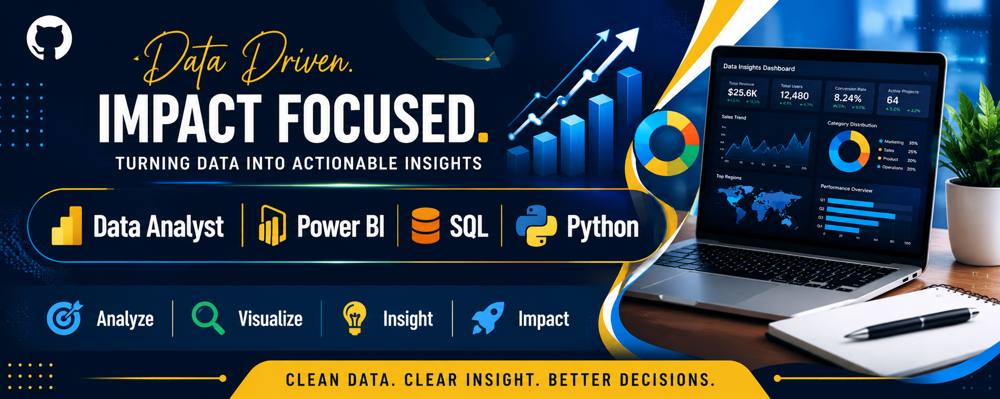

# Umar Musa Isah — Data Analytics Portfolio

### Data Analyst | Monitoring & Evaluation (M&E) | Dashboard & Reporting Specialist

Welcome to my professional data analytics portfolio.

I specialize in transforming raw data into actionable insights that improve decision-making across humanitarian, development, and business environments.

My work focuses on:

- Data Analysis  
- Dashboard Development  
- KPI Tracking  
- Monitoring & Evaluation  
- Reporting & Decision Support  
- Survey Data Systems  

---

# Professional Summary

I am a Data Analyst with practical experience in analytics, business intelligence, monitoring & evaluation, and data-driven reporting.

I build decision-support systems that help organizations:

- monitor performance  
- track indicators  
- identify trends  
- improve operational efficiency  
- support strategic planning  

I am particularly interested in roles within:

- United Nations agencies  
- NGOs / INGOs  
- Development sector  
- Remote analytics teams  

---

# Core Skills

## Analytics
- Excel
- SQL
- Power BI
- Data Cleaning
- Data Modeling

## Reporting
- KPI Reporting
- Executive Reporting
- PowerPoint Storytelling
- Insight Communication

## Monitoring & Evaluation
- Indicator Tracking
- Program Monitoring
- Data Quality Checks
- Results Framework Analysis

## Survey Tools
- KoboToolbox
- CommCare
- Google Forms

---

# Featured Portfolio Projects

## 1. UNICEF Education Monitoring Dashboard
Tracks school enrollment, attendance, gender parity, and intervention effectiveness.

**Key Deliverables**
- Dashboard
- PDF Report
- Presentation
- Case Study

---

## 2. WFP Food Security Dashboard
Analyzes household food security, vulnerability, and nutrition-related indicators.

**Key Deliverables**
- Dashboard
- Trend Analysis
- Reporting Pack
- Executive Presentation

---

## 3. UNDP M&E Indicator Tracker
Monitors development program KPIs and implementation progress.

**Key Deliverables**
- KPI Dashboard
- Indicator Tracker
- M&E Reporting
- Strategic Insights

---

**Key Deliverables**
- Recruitment Dashboard
- Hiring Funnel Analysis
- KPI Monitoring
- Performance Reporting

---

# What I Bring

✔ Strong analytical thinking  
✔ Clean data workflows  
✔ Professional dashboards  
✔ KPI monitoring expertise  
✔ Stakeholder-ready reporting  
✔ Decision-support analytics  

---

# Career Goal

My goal is to contribute to organizations using data to solve real-world problems in:

- Education  
- Food Security  
- Public Health  
- Humanitarian Response  
- Development Programs  

---

# Contact

Email: umarmusapress@gmail.com  
GitHub: https://github.com/UmarMusaIsah  

---

> Turning data into decisions.# data-analytics-portfolio
